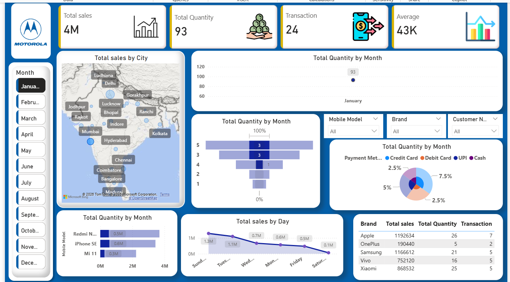

# Mobile Sales Power BI Dashboard

## 📊 Project Overview
This project is an interactive **Microsoft Power BI dashboard** built to analyze **mobile sales data** and uncover meaningful business insights.  
The dashboard helps understand sales performance across **cities, brands, mobile models, months, and payment methods** using clean visuals and dynamic filters.

It is designed from a **business decision-making perspective**, making complex data easy to interpret.

---

## 🛠 Tools & Skills Used
- Microsoft Power BI
- DAX (Data Analysis Expressions)
- Data Modeling
- Data Visualization
- Dashboard Design
- Business Intelligence Concepts

---

## 🔍 Key Insights
- Total sales, quantity sold, and number of transactions
- City-wise and brand-wise sales performance
- Monthly trends in mobile sales and quantity
- Top-performing mobile models
- Payment method distribution (Credit Card, Debit Card, UPI, Cash)
- Interactive slicers for deep-dive analysis

---

---

## ▶️ How to Open the `.pbix` File
1. Download **Microsoft Power BI Desktop** (Windows)
2. Clone or download this repository
3. Open the `.pbix` file using Power BI Desktop
4. Interact with slicers and visuals to explore insights

---

## 📁 Files Included
- `.pbix` file – Full interactive Power BI dashboard
- `screenshots/` – Dashboard preview images
- `README.md` – Project documentation

---

## 📌 About This Project
This project was created as part of hands-on learning to build **job-ready Power BI skills** and demonstrate the ability to convert raw data into actionable insights.

📬 Feel free to connect or share feedback!
